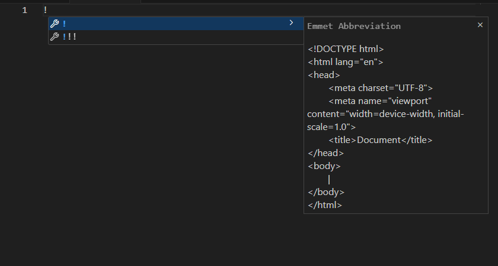
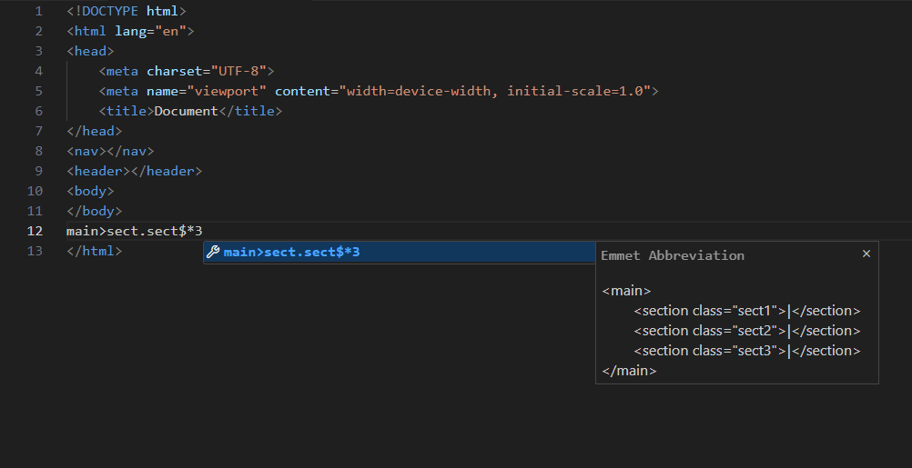
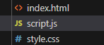
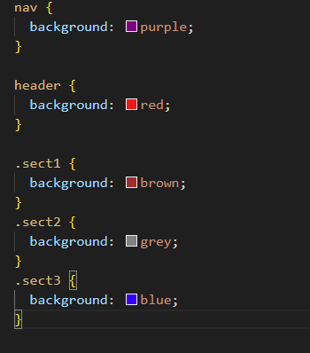
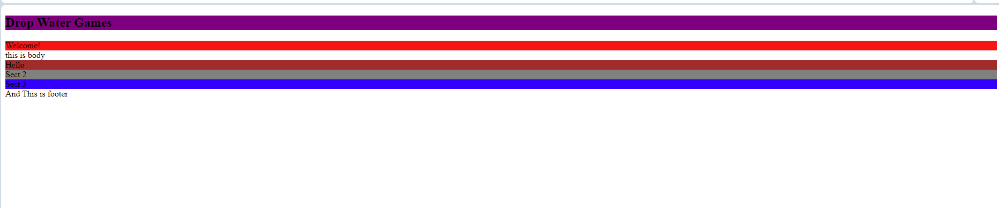
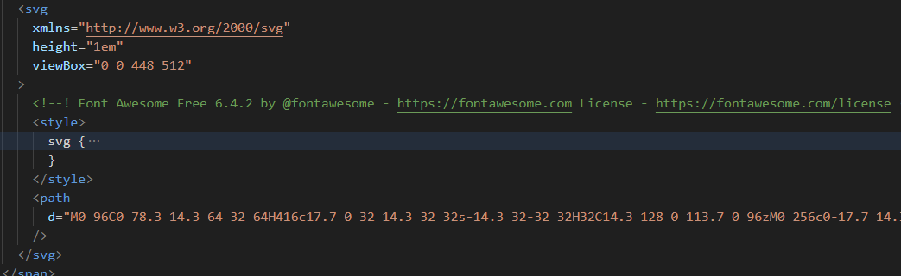
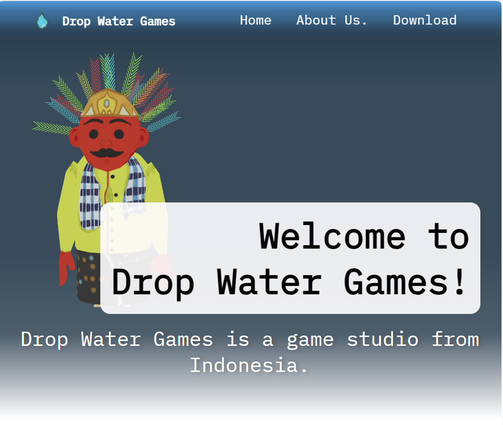
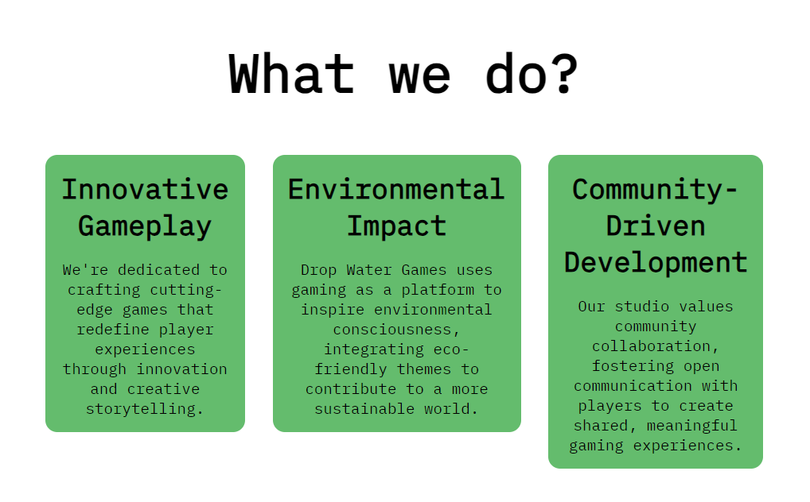
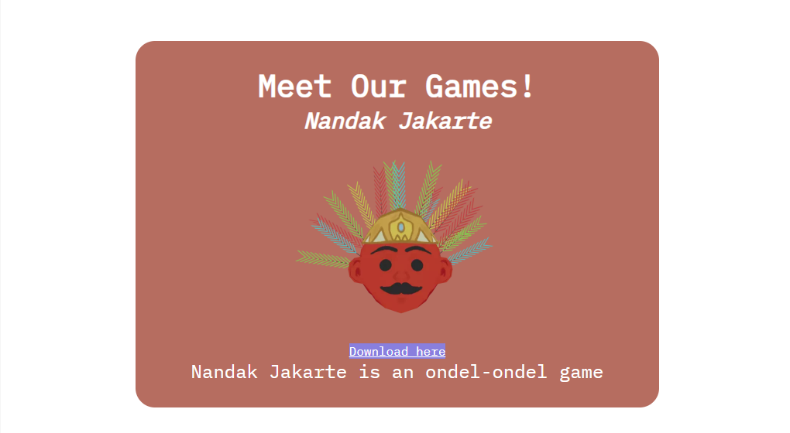
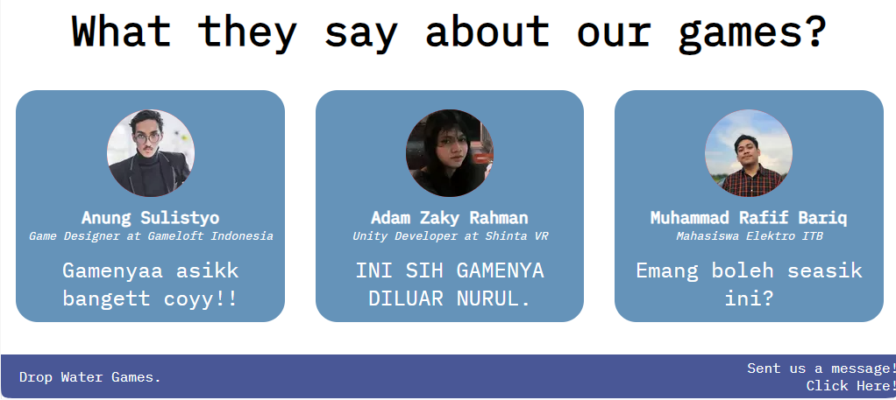

# Hi, I'm David!

In this readme i will explain how i do [my website project.](https://dropwatergames.site)

#### Type all what you need

In this case, i just wrote down what i want to show in my website.
I use emmet because its very helpful and make me type faster.

after that im gonna adding some element just to blockout the element with colour after that. Im using emmet like this to make similar elements.

Dont forget to link css file and js script to html file. and also adding all the meta for better SEO.

I mention about blocking with color before and by that i mean just simply like this.

and the result is like this.

I know its really **ugly** but you'll get used to see that. maybe.

With this step make me to easier trackdown which content i edited and i can track the changes.

#### External Libraries

We all can agree we like to add some icon to make our website to make it looks better. So Im adding some external libraries like SVGs for this projects from Fontawesome.

Im adding icon for hamburger menu

#### Design Choices

In this project i decided to make it simple and straight foward explaining what this company about, with monochrome colour I think its make people less get headache.

So, this is my final result of my website. I know its not that good but i how the message delivered well.
